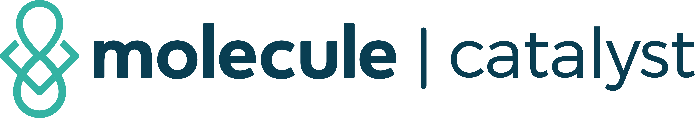
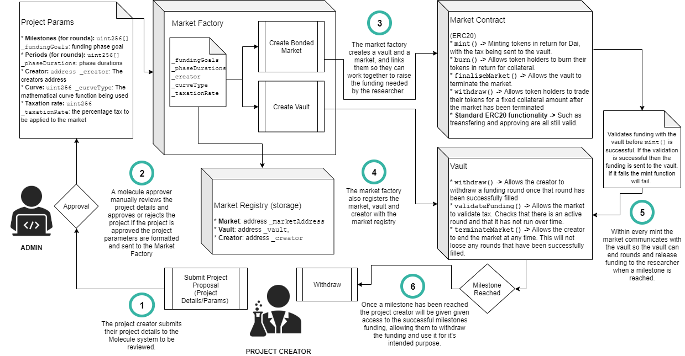
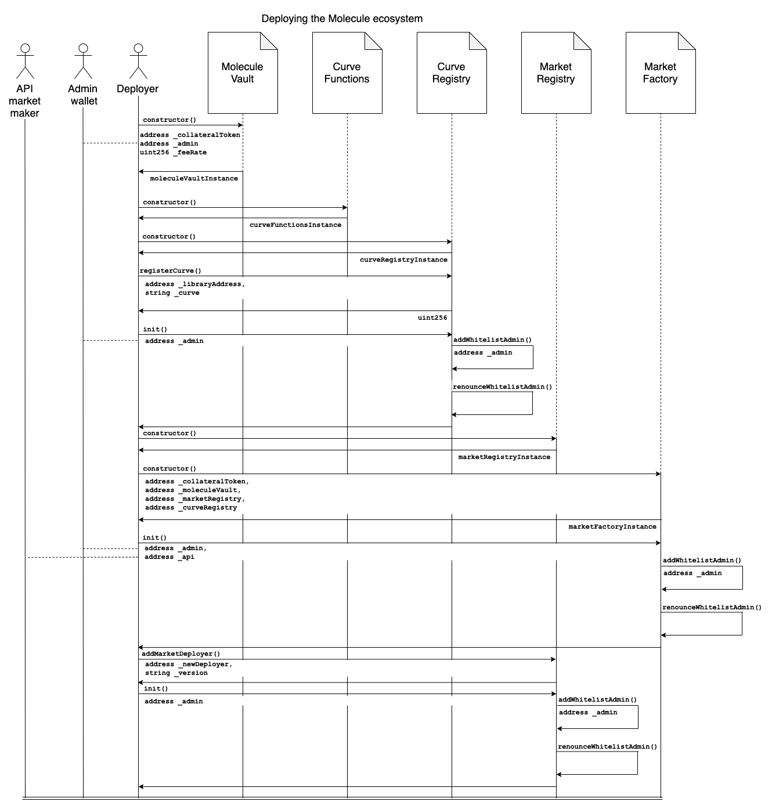
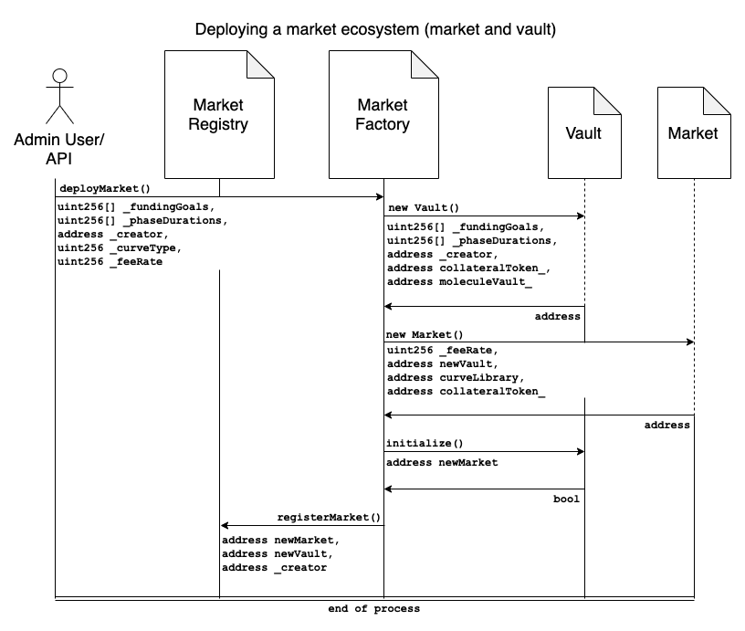
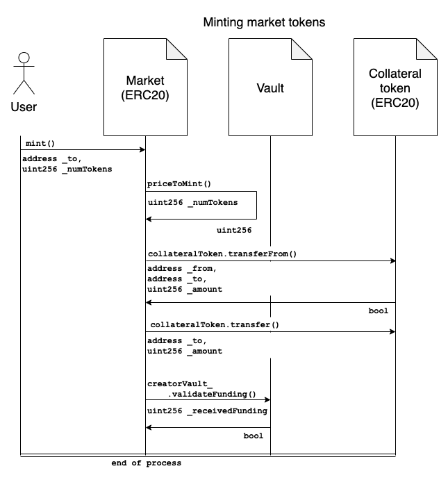
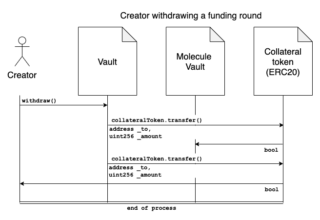
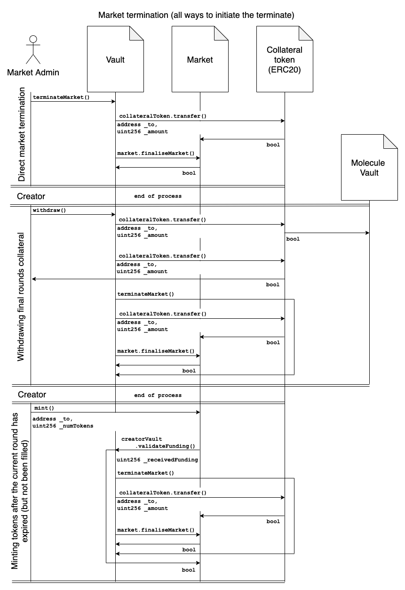

    
    <h3>Molecule Catalyst is an open source crowdfunding platform for medical research and development</h3>

---

# Index

| Section | Topic | Sub-Topic | Sub-sub-Topic |
|:--------|:------|:----------|:--------------|
| 0. Project Details | [0.1 Dependencies](#dependencies) | |
|  | [0.2 Project scripts](#project-scripts) |  |
| 1. Smart Contracts | [1.1 Outline Of Architecture](#outline-of-architecture) | [1.1.1 Ecosystem Outline](#ecosystem-outline) |
| | [1.2 Overview Of Individual Contracts](#overview-of-individual-contracts) | [1.1.2 Vault Contract](#vault-contract) |
|  |  | [1.1.3 Market Contract](#market-contract) |
|  |  | [1.1.4 Market Factory](#market-factory) |
|  |  | [1.1.5 Market Registry](#market-registry) |
|  |  | [1.1.6 Curve Integrals](#curve-integrals) |
|  |  | [1.1.7 Curve Registry](#curve-registry) |
|  |  | [1.1.8 Pseudo Dai  (The mocking of Dai for testing purposes)](#pseudo-dai) |
|  |  | [1.1.9 Project Life Cycle](#project-life-cycle) |
|  | 1.3 Detailed Breakdown of Smart Contracts | [1.3.1 Major functionality breakdown](#major-functionality-breakdown) | [Deploying ecosystem](#deploying-ecosystem) |
| | | | [Creating a market](#creating-a-market)
| | | | [Minting market tokens](#minting-market-tokens)
| | | | [Creator withdrawing](#creator-withdrawing)
| | | | [Market termination](#market-termination)
| | |[1.3.1 Contract Interfaces & Events](./z-docs/ContractInterfaces&Events.md) |
|  |  | [1.3.3 Constructors, Functions & Modifiers]() |
|  |  | [1.3.4 Style Guide](./z-docs/STYLE_GUIDE.md) |
|  |  | [1.3.5 Security Considerations]() |

---

# Project Details

## Dependencies 
This project uses the following tools & libraries. You do not need to manually install these tools as running the scripts in the below section will set them up with the correct versions. 

* `bignumber.js: ^9.0.0`
* `dotenv: 8.0.0`
* `etherlime: 2.2.0`
* `etherlime-lib: 1.1.3`
* `ethers: 4.0.31`
* `openzeppelin-solidity: 2.3.0`
* `solc: 0.5.10`

## Project scripts
For the following example scripts to run, you will need to have `yarn` installed globally. You can use `npm` by replacing `yarn` with `npm run` 
1. First install the required packages by running `yarn`
2. Compile the contracts by running `yarn build`
3. Then, in a separate terminal tab, start the Ganache local blockchain with `yarn start` 
4. To run the tests, execute `yarn test`

---

# Smart Contracts

Below is the details of the Molecule smart contract ecosystem. 

# Outline Of Architecture

## Ecosystem Outline

The Molecule contract ecosystem has multiple components. The major components are:
* Factories: These create new markets
* Registries: These store the addresses and information about markets 
* Markets: A market consists of a market (ERC20 bonding curve) and a vault (storage of funding and )
## Overview Of Individual Contracts

This section will expand on the meaning and use of each contract within the ecosystem, as well as going through the life cycle of a project within the ecosystem. 

### Vault Contract
This Vault contract is a management contract for all the collateral collected in funding the compound. Deployed along side the market, this contract assesses the state of each funding round and will dictate whether the compound's managing admin can withdraw funds collected.

### Market Contract
This contract is a standard ERC20 contract that utilizes a bonding curve integral math contract (more information below).
The market, through the use of the bonding curve contract, can accommodate both token in, collateral amount out, and collateral amount in, token amount out. 

The collateral for the market is MakerDAO's Dai stable coin. Dai is used for its stable properties, as well as its decentralization (as there is no bank account with dollars owned by a central entity guaranteeing value).

To facilitate funding of the vault, the market removes and redirects a percentage of incoming token minting collateral to the vault contract. This could be, as an example, 60% of incoming Dai will be sent to the Vault, with the remaining 40% used to mint tokens into the users account & collateralizing the market.

### Market Factory
This factory allows a user to deploy a full compound market ecosystem atomically. This factory interfaces with a curve registry to get the address of the specified curve function as well as indexing all deployed markets in the `MarketRegistry`.

### Market Registry 
This registry is external to the `MarketFactory`, the purpose of extending it out in this way is to allow for new factories to be registered later without risk of losing the history of all deployed markets, additionally the way factories can be registered & unregistered adds a security feature of being able to shut down and publish factories as needed.

### Curve Integrals
These contracts have `integral` & `inverseIntegral` functions which are called by the `Market` to determine the `mint()` & `burn()` token and collateral values. These functions allow us to work from tokens to collateral needed, and from collateral to tokens that can be bought for that amount of collateral. This allows us to be accommodating to potential investors. 

### Curve Registry
This registry allows Molecule and potentially other authorized accounts to register curve contracts. This allows the market factory to select a curve library from a range of approved curve integrals. 

## Project Life Cycle 

Below is a simplified flow of the contract life cycle. In this section we will go through the life cycle of a project on Molecule Catalyst. 

    

1. The project life cycle starts outside the contracts with the submission of a project to the Molecule Catalyst team. The team reviews applications to ensure only the higheset quality projects make it onto the system. 
2. If the Molecule Catalyst team approves the project, it then gets entered into the contract architecture. The project and its details are formatted and a transaction (`deployMarket()`) is made with the `MarketFactory`. 
3. The `MarketFactory` will then deploy a `Market` and a `Vault` and link them. The linking of the `Vault` and `Market` allows for communication between the two, and the transferring of funds from the `Market` to the `Vault`, and checks enforced from the `Vault` to the `Market`. 
4. The `MarketFactory` also sends the details of the `Vault` and `Market` to the `MarketRegistry`. This means that `MarketFactory`s can be updated and changed without loosing existing market systems. 
5. Whenever a user buys tokens in the `Market`, a portion of the funding is sent to the `Vault`. The portion is determined by the `_taxationRate`. When the `mint()` function executes in the `Market`, the `validateFunding()` function is called on the `Vault`. This function ensures that the rounds is still valid (has not expired), that the round has not ended and that all the rounds have not been finished. 
6. When a milestone (`_fundingGoal`) has been reached, the project creator will then gain access to that funding. The creator can call the `withdraw()` function on the `Vault` and receive a successful rounds funding. The creator can only withdraw a rounds funding when that rounds funding threshold has been reached.

Anytime throughout the projects life cycle the creator can call the `terminateMarket()` function, and end the fund rasing. This function will not result in them loosing any rounds of funding that where already filled, but it will prevent the market from minting new tokens, and wil cause the market to terminate. The `Market`s termination means that users can no longer buy or sell tokens. They can `withdraw()` funding from the market, exchanging tokens they have for collateral in the market. 

---

# Detailed Breakdown of Smart Contracts

## Major functionality breakdown

Below is a breakdown of each of the major functions within the Molecule ecosystem.

### Deploying ecosystem

Deploying an ecosystem refers specifically to the entire Molecule contract ecosystem rather than an individual project. The ecosystem consists of factories (deployer) and registries (persistent storage between possible upgrades). 

    

The ecosystem is deployed by a deployer wallet. The deployer address is assumed to be insecure, and as such is removed/replaced as an admin on the major contracts.

The pattern is such:
The major contract is deployed, the deployer address is automatically added as an admin by the `WhitelistAdmin` contract. The deployer does any registering or secondary functionality that it needs to do, and then the `init()` function is called, adding the admin as an admin and removing the deployer as an admin.

**Validation**
There is no validation on the ecosystem deployment, as there is no pre-existing data to check against in a new instance of the system. 

### Creating a market 

A market consists of a `Market` and a `Vault`. Each market has a set number of funding rounds as well as a set time limit for each round.

    

Only a user who is a `WhitelistAdmin` on the Market Factory can deploy a market system, with the exception of the API, which has been specially added to the `MarketFactory`, and can not do any admin functionality on the `MarketFactory` besides deploying a market. This was done for easy of use, and while it may open the system up to attack, the damage is limited by the scope of permissions given to the API. 

**Validation**
When creating a market, the following things are validated (within the `marketFactory`):
* The `_fundingGoals` and `_phaseDurations` must have the same number of elements in the array. 
* The `_creator` address cannot be a `0x` address.
* The `_curveType` is used against the `curveRegistry` to get the address of the `curveLibrary`. The received `curveLibrary` address is checked for validity (not 0 address). It is also checked for its active state.
* The `_taxationRate` is checked, ensuring that the rate is between (excluding) 0-100.

The following things are validated within the `Vault`:
* The `_fundingGoals` and `_phaseDurations` have matching lengths.
* The `_fundingGoals` length is not smaller than 0 or larger than 10.

The market does no validation.

### Minting market tokens

The tokens conform to the standard ERC20 model, with the added functionality of a `withdraw()` for once the market has been terminated. For more information about the market termination process, please see [this](#market-contract-cfm).

    

Any address can mint project tokens.

**Validation**
The following is validated within the `Market`:
* The price for the number of tokens is bigger than 0
* Requires that all `.transfer()`s pass
* Requires the `validateFunding()` call on the vault passes

The `Vault` within the `validateFunding()` function, checks:
* That the current phase has started (this checks it is not the phase after the last phase, as that phase is never set to started)
* That the current phase has not expired (run over its pre-set end date)
* If there is an funding that pushes the vault over the `_fundingThreshold` then it will roll that funding over into the next funding round 
* If that funding roll over will next the next round (or any round after that) the rounds are looped through and ended. 

### Creator withdrawing 

The `Vault` allows for the creator to withdraw any successfully completed funding rounds. If multiple rounds have been completed, calling the `withdraw()` function will withdraw all outstanding completed rounds funding.

    

The `withdraw()` function can only be called by a `WhitelistAdmin` of the `Vault`.

**Validation**
The `Vault` validates that 

### Market termination 

    

The market can be terminated in 3 ways.

**Validation**

## Contract Interfaces & Events

The document that covers the Contract Interfaces & Events was omitted from this document to maintain a reasonable length. It can be found [here](./z-docs/ContractInterfaces&Events.md).

## Constructors, Functions & Modifiers

### Vault Contract CFM

### Market Contract CFM

### Market Factory CFM

### Market Registry CFM

### Curve Integrals CFM

### Curve Registry CFM